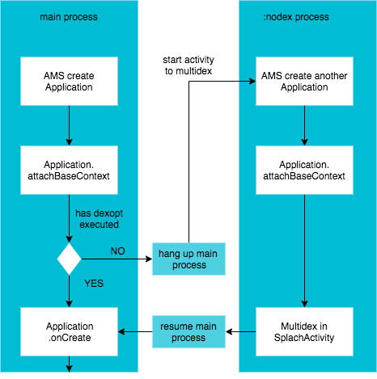

# Dexing

[](https://github.com/hacktons/convex_bottom_bar)
[](http://www.apache.org/licenses/LICENSE-2.0.txt)
[](https://travis-ci.com/hacktons/dexing)


When your app and the libraries it references exceed 65,536 enmethods, we need to ship apk with multidex enable, usually follow the guides:
[Enable multidex for apps with over 64K methods](https://developer.android.com/studio/build/multidex).

However the main dex `classes.dex` can still be too large; It' difficult to maintain the mainDexList.txt since your app's keep growing.

What's more, the gradle task for multidex can changes too, that may break our task hook.

The `dexing` library can help you get rid of maintaining the mainDexList.txt，since we've minimize the classes needed before `multidex` and `optdex`:



## How to use

1.Add dependence to `dexing` aar：

```gradle
implementation 'com.github.avenwu:dexing:$latest_version'
```

2.Install dex in application:

The install api is same as `multidex support library`:

```java
import cn.hacktons.dexing.Multidex;

public class CustomApplication extends Application {
    @Override
    protected void attachBaseContext(Context base) {
        super.attachBaseContext(base);
        Multidex.install(this);
    }
}
```
3.That's all


## Advance

We've provided a Activity with simple loading process bar when dex is installing. You may replace the loading layout through the second parameter of `Multidex.install`:
```java
Multidex.install(this, R.layout.custom_loading);
```

If there are ClassNotFoundException, keep missing class in the `multiDexKeepProguard` file as [Enable multidex for apps with over 64K methods](https://developer.android.com/studio/build/multidex) mentioned.
